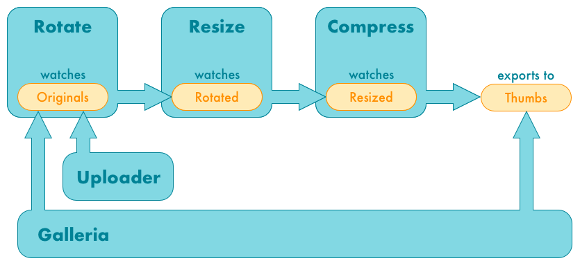

# serverless-galleria

Serverless batch photo manipulation and publishing

## Design
### Uploader
The Uploader stores images in an S3 bucket.  It doesn't own any buckets.

* [uploader](uploader) - Serverless web application for uploading images to S3

### Transformations
A transform owns an S3 bucket, which it watches for incoming files.  When files are added, it runs a lambda function to transform the images and place them in another S3 bucket

* [blur](blur) - Apply a configurable blur
* [compress](compress) - Apply image compression to reduce image file size
* [crop](crop) - Apply a configurable crop
* [resize](resize) - Apply a configurable resize
* [rotate](rotate) - Apply a configurable rotation with configurable background color
* [sepia](sepia) - Apply sepia tone

### Galleria
The Galleria reads from two S3 buckets, one for reading image thumbnails, the other for full-size images.  It doesn't own any buckets.

* [galleria](galleria) - Beautiful web interface for displaying photo gallery

## Setup
First, plan your pipeline, as you'll build it backwards.  Here's a sample:

### Steps
1. Deploy Application
    1. Create the thumbs bucket, as it's not owned by any transformations
    1. Deploy the compress transform, with the resized bucket as its source, and thumbs bucket as its destination
    1. Deploy the resize transform, with the rotated bucket as its source, and resized bucket as its destination
    1. Deploy the rotate transform, with the originals bucket as its source, and rotated bucket as its destination
    1. Deploy the uploader, with the originals bucket as its destination
    1. Deploy the galleria, with originals as its full-size bucket, and thumbs as its thumb bucket
1. Upload photos
    1. In the [API Gateway Console](https://console.aws.amazon.com/apigateway), navigate to APIs / uploader / Dashboard
    1. Find the Invocation url, something like *https://xxxxxxxxx.execute-api.region.amazonaws.com/Prod/*
        1. (You can also set up [custom domain name](http://docs.aws.amazon.com/apigateway/latest/developerguide/how-to-custom-domains.html))
    1. Open the invocation url in your browser, and drag photos on to the drop point to upload
1. View galleria
    1. Set up a [custom domain name](http://docs.aws.amazon.com/apigateway/latest/developerguide/how-to-custom-domains.html) for the galleria API, then open it in your browser

## License
&copy; 2017-2019 [Evan Chiu](https://evanchiu.com). This project is available under the terms of the MIT license.
